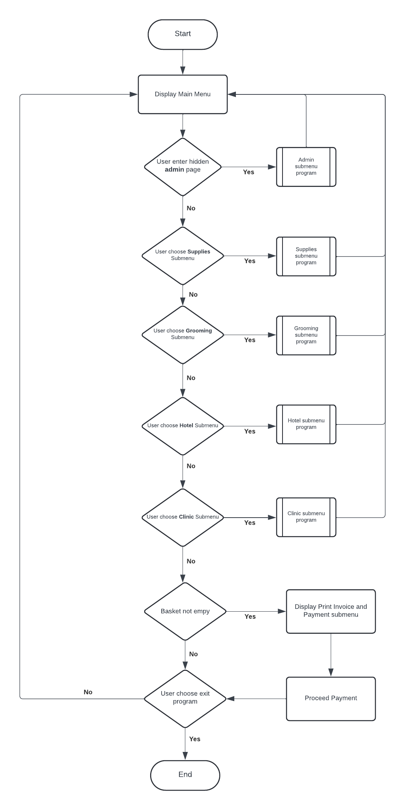
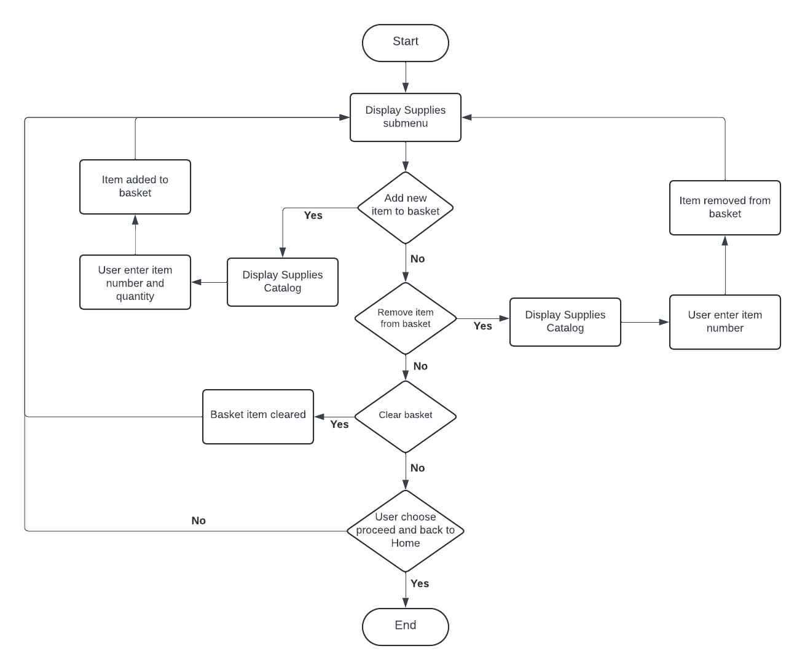

# WhiskersBeyond - A Pet Store App
## Overview
WhiskersBeyond is a pet store app developed as the first module of Purwadhika's Digital Talent Incubator Program, with a focus on Data Science & Machine Learning Specialization. It caters to both administrators and customers, providing a range of services including pet supplies, grooming, hotel stays, and clinic appointments.

## Features
### For Customers:
- Shop for pet supplies: Browse and purchase a variety of pet supplies.
- Reserve grooming: Reserve grooming appointments for your pet.
- Book hotel stays: Arrange accommodation for your pets when needed.
- Reserve clinic treatments and medication: Reserve appointments with veterinary clinics.
- Print invoices: Generate and print invoices for your transactions.
- Proceed with payment: Complete your purchases securely through the app.
### For Admins:
- Add new items to supplies: Expand the inventory by adding new products to the supplies section.
- Update stocks: Manage inventory levels by updating stock quantities.
- Manage services visibility: Customize the visibility of services in grooming and clinic menus.

## Feature Division
### Main CRUD Features:
explain each CRUD function

- All customer-facing app features including Supplies, Grooming, Hotel, Clinic, and Payment functionalities.
- Administrative tools for adding new items and updating stock levels in the Supplies section.

### Additional Features and Enhancements:
- Consolidation of services (Supplies, Grooming, Hotel, Clinic, and Payment) into a single invoicing process for streamlined transactions.
- Enhanced flexibility with the option to configure service visibility in the Clinic menus.

## Flowchart
Main Menu:


Supplies Submenu:

## Installation
Installing tabulate library:
```bash
pip install -r requirements.txt
```
Setting up python virtual environment
```bash
    python3 -m venv venv
    source venv/bin/activate
```

Running program:
```bash
    python main.py
```
