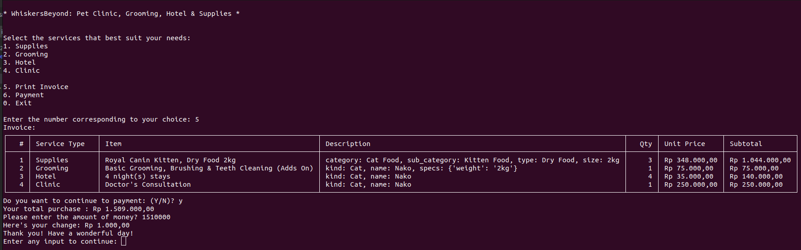
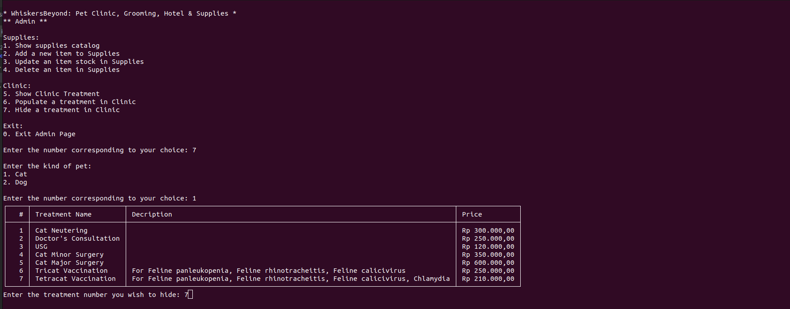
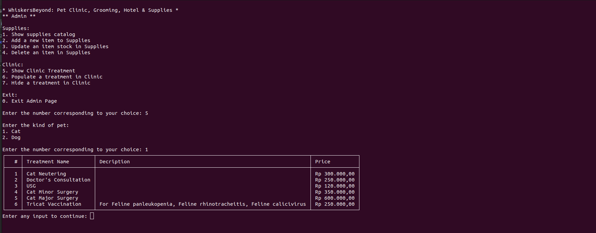
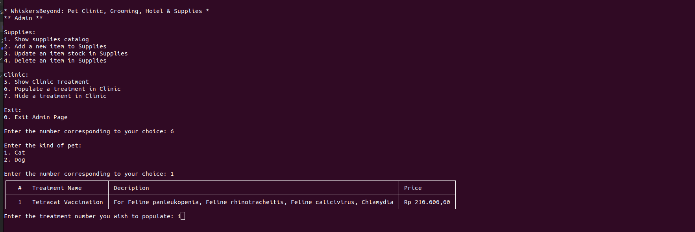
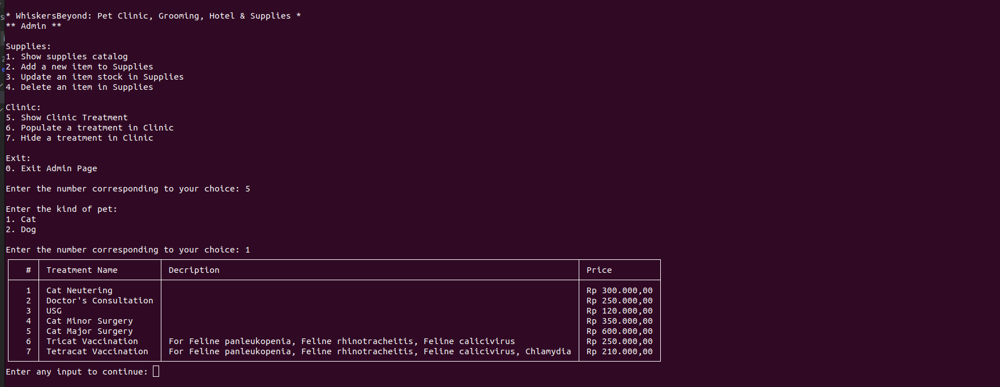

# WhiskersBeyond - A Pet Store App

<details>
  <summary>Table of Contents</summary>
  <ol>
    <li>
      <a href="#overview">Overview</a>
    </li>
    <li>
      <a href="#installation-guide">Installation Guide</a>
    </li>
    <li>
      <a href="#all-features">All Features</a>
    </li>
    <li>
      <a href="#all-features-categorized-by-evaluation-criteria">All Features Categorized by Evaluation Criteria</a>
    </li>
    <li>
      <a href="#flowchart">Flowchart</a>
    </li>
  </ol>
</details>

## Overview
WhiskersBeyond is a pet store app developed as Capstone Project for the first module of Purwadhika's Digital Talent Incubator Program, specializing in Data Science & Machine Learning. It serves both administrators and customers, offering a variety of services such as pet supplies, grooming, hotel accommodations, and clinic appointments.

## Installation Guide
1. Clone the repo
    ```bash
    git clone https://github.com/mfarik21/WhiskersBeyond-App.git
    ```

2. Installing tabulate library:
    ```bash
    pip install -r requirements.txt
    ```

3. Setting up python virtual environment
    ```bash
    python3 -m venv venv
    source venv/bin/activate
    ```

4. Running program:
    ```bash
    python main.py
    ```

## All Features
### For Customers:
- Shop for pet supplies: Browse and purchase a variety of pet supplies.
- Reserve grooming: Reserve grooming appointments for your pet.
- Book hotel stays: Arrange accommodation for your pets when needed.
- Reserve clinic treatments and medication: Reserve appointments with veterinary clinics.
- Print invoices: Generate and print invoices for your transactions.
- Proceed with payment: Complete your purchases securely through the app.
### For Admins:
- Add new items to supplies: Expand the inventory by adding new products to the supplies section.
- Update stocks: Manage inventory levels by updating stock quantities.
- Manage services visibility: Customize the visibility of services in grooming and clinic menus.

## All Features Categorized by Evaluation Criteria
### Main CRUD Features:
***Administrator-Facing App:***
1. CREATE:
    - Supplies (Add a new item to Supplies): Add new item to Supplies catalog.
2. READ:
    - Supplies (Show Supplies Catalog): Display Supplies Catalog.
3. UPDATE:
    - Supplies (Update an item stock in Supplies): Update stock from an item in Supplies Catalog.
4. DELETE:
    - Supplies (Delete an item in Supplies): Delete an item from Catalog.

***Customer-Facing App:***
1. CREATE:
    - Supplies (Add new item to basket): Add a new item to the basket from the Supplies catalog.
    - Grooming (Checkout a service): Checkout a grooming service and add it to the basket.
    - Hotel (Add a reservation): Add a reservation for a pet's hotel stay.
    - Clinic (Request a treatment): Request a treatment or medication from the clinic.

2. READ:
    - Supplies: The basket for Supplies will automatically be shown on its submenu once an item is added to the basket.
    - Grooming : The basket for Grooming will automatically be shown on its submenu once a service is added to the basket.
    - Hotel : The basket for Hotel will automatically be shown on its submenu once an reservation is added to the basket.
    - Clinic : The basket for Clinic will automatically be shown on its submenu once a treatment/medication is added to the basket.

3. UPDATE:
    - None

4. DELETE
    - Supplies (Remove an item from basket): Remove an item from the basket by selecting this option.
    - Grooming (Remove a service from basket): Remove a service from the basket by selecting this option.
    - Hotel (Cancel a reservation): Cancel a reservation by selecting this option from the Hotel menu.
    - Clinic (Cancel a treatment): Cancel a treatment or medication request by selecting this option from the Clinic menu.


    - Supplies, Grooming, Hotel, Clinic (Clear Basket): Empties the basket for each corresponding menu.


### Additional Features and Enhancements:
- Consolidation of services (Supplies, Grooming, Hotel, Clinic, and Payment) into a single invoicing process for streamlined transactions.

    The contents of each basket are consolidated into a single payment through mapping process as follows:
    

- Enhanced flexibility with the option to configure service visibility in the Clinic menus.

    Hiding a treatment from clinics
    

    The selected treatment will not be shown as follows:
    

    Populating a treatment
    

    The selected treatment will reappear as follows:
    
## Flowchart
Flowchart for Main Menu:


Sample Flowchart for Supplies Submenu:

